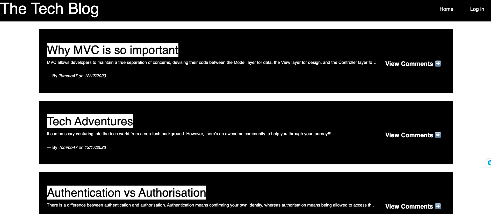
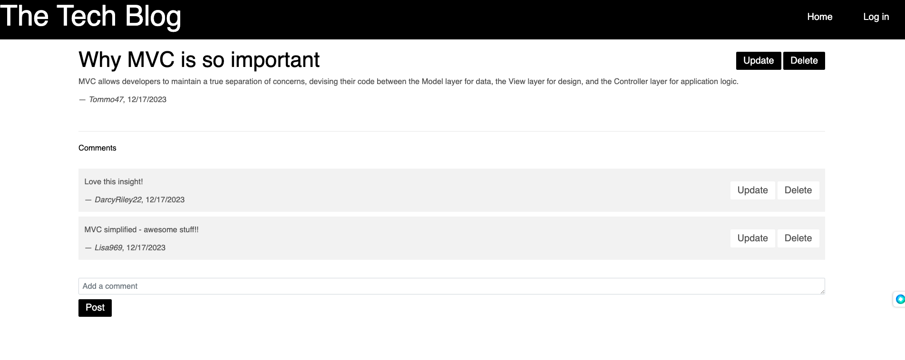

# Tech Blog Application 🌐

## Description
The purpose of this project is to utilise the MVC (Model-View-Controller) Framework, Handlebars.js and MySQL2 to provide a platform for users to interact with each other and share their insights on tech-related matters.

## Requirements
- Ensure first visit to website presents user with homepage including existin gblog posts and nav links for homepage, dashobard and login
- Ensure homepage option takes user to homepage
- Ensure user is prompted to sign up or sign in when clicking other links in nav
- Ensure when prompted to sign up, user can create a username and password whereby user credentials are saved and then user is logged onto site
- Ensure revisiting site at later time and choosing to sign in prompts uers with username and password
- Ensure when signed into site, presented with nav links for homepage, dashboard and log out options
- Ensure clicking on homepage nav link takes user to homepage with existing blog posts with title and date created
- Ensure clicking existing post presents user with title, contents, creator username and date created for post + option to leave comment
- Ensure entering a comment and clicking submit while signed in saves comment and displays comment, creator username and date created
- Ensure clicking dashboard in nav takes users to dashboard and presents blog posts user has created and option to create new blog post
- Ensure clicking option to create new blog post prompts user to enter both title and contents for post
- Ensure clicking button to create new post saves title and contents and taken back to updated dashboard with new blog post
- Ensure able to delete or update post and taken back to updated dashboard
- Ensure clicking logout option in nav logs user out of site
- Ensure being idle for more than a set time allows user to view posts and comments but is prompted to log in again before beign able to add, update or delete posts

## Heroku Application Preview

## Submission Requirements
- [Deployed Application](https://shielded-garden-20830-c9ecb1046db7.herokuapp.com/)
- [GitHub Repo](https://github.com/ajayshans/tech-blog-app)